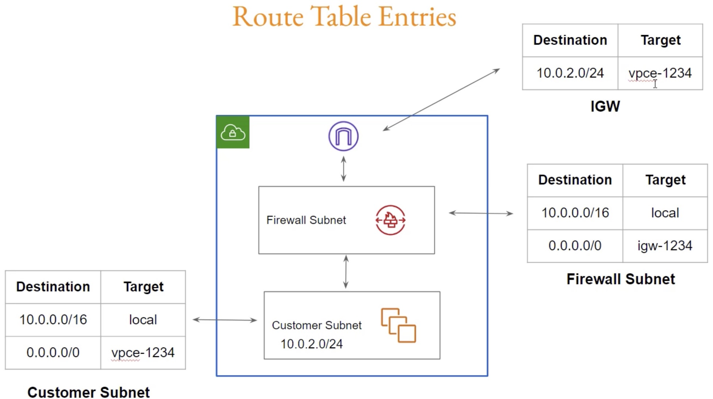

# 🔥 AWS Network Firewall Lab (Terraform)

## 🧠 Overview

This project demonstrates how to use **AWS Network Firewall** with Terraform to:

* control traffic between subnets and the internet
* implement **domain-based filtering (e.g., block facebook.com)**
* understand routing, stateless vs stateful rules, and inspection flow

---

## 🏗️ Architecture



```text
Internet Gateway (IGW)
        ↓
Network Firewall (Firewall Subnet)
        ↓
Customer Subnet (EC2 Instance)
```

### 🔄 Traffic Flow (VERY IMPORTANT)

```text
Outbound:
EC2 → Firewall → Internet

Inbound (return traffic):
Internet → Firewall → EC2
```

👉 Both directions MUST pass through the firewall

---

## 🧩 Components

### 1️⃣ VPC & Subnets

* Firewall subnet (for Network Firewall)
* Customer subnet (EC2 instance)

---

### 2️⃣ Network Firewall

* Deployed in firewall subnet
* Creates **endpoint per AZ**

---

### 3️⃣ Route Tables

#### Customer subnet route table

```text
0.0.0.0/0 → Firewall endpoint
```

#### IGW route table (ingress routing)

```text
Customer subnet CIDR → Firewall endpoint
```

---

## ⚙️ Firewall Policy

### ❌ Incorrect (initial issue)

```hcl
stateless_default_actions = ["aws:drop"]
```

👉 Problem:

* Drops all traffic before stateful inspection
* Domain filtering never works

---

### ✅ Correct

```hcl
stateless_default_actions = ["aws:forward_to_sfe"]
```

👉 This sends traffic to **stateful engine**

---

## 🧠 Stateless vs Stateful

| Type      | Description                                |
| --------- | ------------------------------------------ |
| Stateless | Fast, no connection tracking               |
| Stateful  | Tracks sessions, supports domain filtering |

---

## 🚫 Domain Blocking Issue

### Problem

Even after adding rule for:

```text
facebook.com
```

This command still worked:

```bash
curl -I https://facebook.com
```

---

## 🔍 Root Cause

👉 HTTPS traffic uses **TLS**, not HTTP

So:

* `HTTP_HOST` → works only for HTTP
* `TLS_SNI` → required for HTTPS

---

## ✅ Fix (Critical)

Update rule group:

```hcl
resource "aws_networkfirewall_rule_group" "domain_filter" {
  capacity = 100
  name     = "domain-filter"
  type     = "STATEFUL"

  rule_group {
    rules_source {
      rules_source_list {
        generated_rules_type = "DENYLIST"
        target_types         = ["TLS_SNI", "HTTP_HOST"]
        targets              = ["facebook.com"]
      }
    }
  }
}
```

---

## 🧠 Key Learning

### 🔥 HTTPS domain filtering requires TLS_SNI

👉 Without `TLS_SNI`, HTTPS domains will NOT be blocked

---

## 🧪 Test

```bash
curl -I https://facebook.com
```

Expected:

```text
Connection blocked / timeout
```

---

## ⚠️ Common Mistakes

### ❌ Using STATELESS rule for domain filtering

👉 Domain filtering only works in **STATEFUL**

---

### ❌ Not forwarding traffic to stateful engine

👉 Must use:

```hcl
aws:forward_to_sfe
```

---

### ❌ Wrong routing (bypassing firewall)

👉 Both directions must go through firewall

---

### ❌ Missing TLS_SNI

👉 HTTPS traffic will bypass rules

---

## 📊 Debugging Tips

### Enable logging

```hcl
aws_networkfirewall_logging_configuration
```

Send logs to:

* CloudWatch
* S3

---

### Useful test commands

```bash
curl -v https://facebook.com
```

```bash
openssl s_client -connect facebook.com:443 -servername facebook.com
```

---

## 🎯 Interview Summary

> AWS Network Firewall requires stateful inspection for domain-based filtering. For HTTPS traffic, the firewall inspects the TLS SNI field, so `TLS_SNI` must be included in the rule group target types to block domains like facebook.com.

---

## 🚀 Key Takeaways

* Network Firewall = **advanced, stateful firewall**
* Domain filtering works only in **stateful engine**
* HTTPS filtering requires **TLS_SNI**
* Routing design is **critical**
* Stateless rules must forward traffic to stateful engine

---

## 🏁 Conclusion

This lab demonstrates real-world firewall behavior and highlights the importance of:

* correct rule configuration
* proper routing
* understanding protocol-level inspection

---

## 👨‍💻 Author

Hands-on practice for:

* AWS Network Firewall
* Terraform
* Security architecture

---
